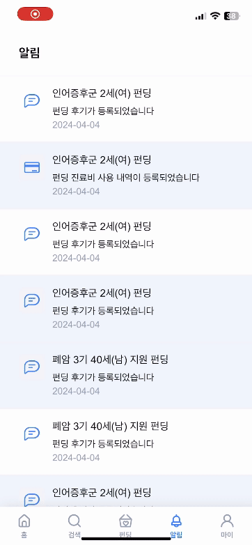

# 🧩 GIVEUS

### === Contents ===

- [개요](#1-개요)
- [프로젝트 소개](#2-프로젝트-소개)
- [서비스 주요 기능](#3-서비스-주요-기능)
- [관리자 서비스 주요 기능](#4-관리자-서비스-주요-기능)
- [기술 스택](#5-기술-스택)
- [Design](#6-Design)
- [Team](#7-Team)

## 1. 개요

- 개발 기간: 2024.02.26 - 2024.04.05 (6주)
- 삼성 청년 소프트웨어 아카데미(SSAFY) 블록체인 프로젝트  
  `블록체인` `크라우드 펀딩` `기부`

## 2. 프로젝트 소개

블록체인을 통한 병원비 크라우드 펀딩 프로젝트

## 3. 서비스 주요 기능

### 3.1 소셜로그인
|  |
| :-----------------------------------------------: |
| - 소셜로그인을 통한 회원가입 ( 카카오 로그인 ) |

### 3.2 메인
|  |
| :-----------------------------------------------: |
| - 실시간 기부 참여자 확인 |
| - 총 기부 금액 확인 |
| - 최근 등록된 후기 및 곧 종료되는 펀딩 확인 |
| - 펀딩 선택시 펀딩 상세 조회 페이지로 이동 |

### 3.3 검색
|  |
| :-----------------------------------------------: |
| - 최근 검색어 저장 |
| - 지우기를 통한 최근 검색어 모두 삭제 |
| - 펀딩 선택시 펀딩 상세 조회 페이지로 이동 |

### 3.4 펀딩 목록
| 필터 | 정렬 |
| :---------------------------------: | :-----------------------------------: |
|  |  |
| - 펀딩 상태 ( 진행중, 진행완료 ), 나이 필터링 |  - 기간순, 참여자순, 최신 등록순, 높은 목표금액순, 낮은 목표금액순 정렬 |
| - 진행 완료된 펀딩은 병원이 등록한 진료비 사용 내역 확인 가능 |  |

### 3.5 후원하기
| 카드 결제 | 포인트 결제 |
| :---------------------------------: | :-----------------------------------: |
|  |  |
| - 금액 버튼을 누르거나 직접 입력하여 후원 금액 설정 | - 미리 충전한 포인트만으로 후원 가능 |
| - 결제 수단으로 토스페이, 카카오페이 선택 | |
| - 기부자 공개 여부를 위한 실명 및 닉네임 선택 | |
| - 후원 완료시 기부자 명단 내 기부 내역 실시간 확인 가능 | |

### 3.6 알림
|  |
| :-----------------------------------: |
| - 최근에 온 알림순으로 기본 정렬 |
| - 참여한 펀딩에 대한 진료비 사용 내역이 등록되었을 때 알림 |
| - 참여한 펀딩에 대한 기부 후기가 등록되었을 때 알림 |
| - 알림 선택시 펀딩 상세 조회 페이지로 이동 |

### 3.7 마이페이지
| 포인트 관리 | 후원 내역 | 설정 |
| :-----------------------------------: | :-----------------------------------: | :-----------------------------------: |
|  |  |  |
| - 현재 보유 포인트 확인 | - 총 후원금액 확인 | - 조회 기간, 펀딩상태 ( 전체, 진행중, 진행완료 )으로 필터링 | - 라이트모드, 다크모드 설정 가능 |
| - 금액 버튼을 누르거나 직접 입력하여 포인트 충전 금액 설정 | - 펀딩 선택시 펀딩 상세 조회 페이지로 이동 | |
| - 결제 수단으로 토스페이, 카카오페이 선택 | | |
| - 조회 기간, 포인트 사용 유형 ( 전체, 충전만, 사용만 ) 으로 필터링 | | |

---

## 4. 관리자 서비스 주요 기능

### 4.1 펀딩 등록

- 진단서를 OCR 검사를 통해 상세 정보를 자동 입력되게 함
- 보호자 휴대폰 번호, 펀딩 목표 금액, 펀딩 종료일을 직접 입력해야 함
- 펀딩 등록시 펀딩정보가 블록체인에 동시에 저장됨
- 펀딩 등록시 보호자 휴대폰 번호에 문자로 이미지, 설명을 추가로 작성하는 링크가 전송됨
- 보호자가 추가 정보를 입력하면 최종적으로 펀딩이 등록됨

### 4.2 펀딩 목록

- 펀딩 고유 번호, 환자번호, 환자성명, 생년월일, 병명, 펀딩상태, 목표금액을 확인할 수 있음
- 고유번호, 환자번호, 환자성명, 병명으로 검색 가능

### 4.3 후기 등록

- 병원이 진료비 사용 내역을 OCR을 통해 자동 입력되게 함
- 진료비 사용 내역 등록시 블록체인에 저장됨
- 진료비 사용 내역을 등록하면 자동으로 수혜자한테 후기를 등록하는 링크가 메세지로 전송됨
- 후기를 작성하면 펀딩을 참여했던 모든 사람들에게 알림이 전송됨

## 5. 기술 스택

### 5.1 FrontEnd

&nbsp;&nbsp;&nbsp;&nbsp;&nbsp;&nbsp;&nbsp;&nbsp;&nbsp;&nbsp;&nbsp;&nbsp;

### 5.2 Backend

**API 서버**

&nbsp;&nbsp;&nbsp;&nbsp;&nbsp;

**DB**

&nbsp;

**CI/CD**

&nbsp;&nbsp;&nbsp;&nbsp;&nbsp;&nbsp;&nbsp;

**Communication**

&nbsp;&nbsp;&nbsp;&nbsp;&nbsp;&nbsp;

## 6. Design

### 6.1 시스템 구조도

### 6.2 ERD

## 7. Team

- 팀장: 이하늬
- 팀원:김내림, 박형규, 서지현, 승재홍, 이승호
